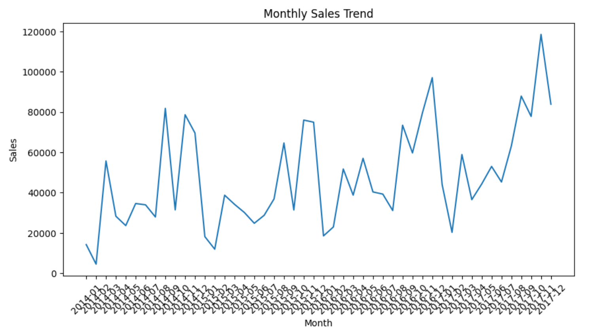

# 🚀 FUTURE ML TASK 1 - Sales Forecasting

Track Code: ML

---

## 📌 Project Overview
This project focuses on predicting future sales using historical Superstore dataset.  
Machine Learning techniques are used to analyze sales trends and forecast future demand.

---

## 🎯 Objective
To build a sales forecasting model that helps businesses predict future sales and improve decision-making.

---

## 🛠️ Tools & Technologies
- Python
- Pandas
- NumPy
- Matplotlib
- Scikit-learn

---

## 📊 Steps Performed
- Data loading and cleaning  
- Time-series feature engineering  
- Monthly sales aggregation  
- Model training (Linear Regression / Random Forest)  
- Prediction of future sales  
- Data visualization  

---

## 📈 Visualizations

### Sales Trend

## 🔮 Future Prediction
The model is used to forecast future sales based on past trends.

---

## 💡 Business Impact
This project helps businesses in:
- Inventory management  
- Demand forecasting  
- Reducing overstocking and losses  
- Better financial planning  

---

## 👨‍💻 Author
Apoorva

---

## 📌 Note
This project is part of Machine Learning Internship Task (Future Interns).
